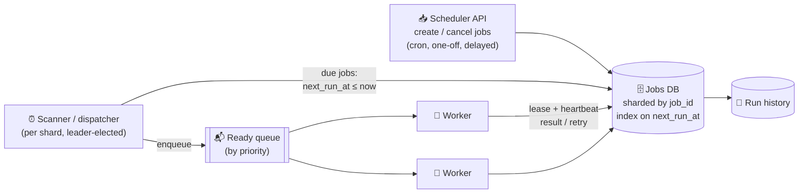

# 097 · Design a Distributed Job Scheduler

> ⏱ 12 min · 📈 97% · 🅱️ Part B (advanced) · Phase 11: Data Processing & Advanced Designs
>
> `███████████████████░` 97% of the whole guide
>
> 🧬 **Atoms used:** queues [057] · leader election & leases [086] · fencing [086] · idempotency [055] · retries/backoff [063] · sharding [049] · delivery semantics [060] · observability [067]

---

## 📖 Story

Pantry needs to send millions of "your cooking class starts in one hour" reminders, run the weekly payouts, and retry failed jobs, all on time and never skipped. The old single scheduler server keeps crashing. Maya designs a distributed job scheduler.

## 🎯 One-sentence idea

**A distributed job scheduler stores jobs with their next run time, efficiently finds the ones that are due, hands each to exactly one worker via a lease, retries failures with backoff, and assumes jobs may run more than once (so the jobs themselves must be idempotent).**

## 🧸 Analogy

A **hospital's medication schedule**:

- A **big board** lists every patient's next dose time (the jobs table).
- A **coordinator** checks the board every minute: "Who's due now?" and hands each due task to a **free nurse** (a worker).
- The nurse **signs the task out** with a time limit (a lease). If the nurse doesn't report back in time (fainted, got distracted), the task is **handed to another nurse**.
- Because a task might occasionally be done twice, doses are recorded so **nobody gets double-dosed** (idempotency).

## 🖼️ Visual



## 🔬 How it works

### 1️⃣ Requirements
- **Functional:** schedule one-off (run at T), delayed (run in 10 min), and recurring (cron) jobs. Cancel and update jobs. Retries with backoff. Job history and status. Priorities.
- **Non-functional:** jobs run **on time** (within seconds of the scheduled time), **at least once** (never silently skipped), with duplicates minimized, high availability, and scaling to **millions of jobs**.

### 2️⃣ Estimates
```
100M scheduled jobs · 10k jobs due per second at peak (e.g., on the hour)
Each job run ~seconds to minutes → worker pool sized by Little's Law: 10k/s × 30 s avg = 300k concurrent 😮 (so smooth out peaks, or scale the workers)
```

### 3️⃣ Finding due jobs (the core deep dive)
- **Option A: DB polling:** `SELECT ... WHERE next_run_at <= now() AND status='scheduled' ORDER BY next_run_at LIMIT 1000 FOR UPDATE SKIP LOCKED`. Simple, and works well to a certain scale. Index on `(next_run_at)`. Shard across DBs by job_id.
- **Option B: time-bucketed queues:** jobs are placed into per-minute buckets (e.g., the Redis sorted set `ZADD due <timestamp> job_id`). The dispatcher pops `ZRANGEBYSCORE due -inf now`.
- **Option C: hierarchical timing wheels** in memory (Kafka and Netty use them for timers), backed by durable storage.
- **One dispatcher per shard:** use **leader election** (lesson 086) so two dispatchers don't enqueue the same job (and be idempotent anyway).

### 4️⃣ Executing reliably
- A worker **claims** a job with a **lease** (`locked_by`, `lease_expires_at`) and **heartbeats** to extend it for long jobs.
- Success → mark done, and compute `next_run_at` for recurring jobs (from the cron expression).
- Failure → retry with **exponential backoff + jitter** (lesson 063), up to max attempts → then **dead-letter** and alert.
- **Lease expiry** (worker crashed) → the job becomes claimable again → **at-least-once**.
- **Fencing token** (an attempt number) with the job's side effects, so a zombie worker from a previous attempt can't overwrite the results.
- **Jobs must be idempotent** (keyed by job_id + scheduled_time).

### 5️⃣ Cron specifics
- Store the cron expression + time zone. Compute the next fire time after each run. Decide the **misfire policy** (if the system was down at 3:00, run once on recovery, or skip?).
- **Thundering herd at :00:** many jobs are scheduled "at the top of the hour". Add jitter where it's allowed, and scale the workers ahead of time.

### 6️⃣ Multi-tenancy & fairness
- Per-tenant **quotas and concurrency limits**, and priority queues. Keep noisy tenants from starving others (bulkheads).

## 🧩 Worked example

**Claiming jobs safely with Postgres:**

```sql
WITH due AS (
  SELECT job_id FROM jobs
  WHERE status = 'scheduled' AND next_run_at <= now()
  ORDER BY priority DESC, next_run_at
  LIMIT 100
  FOR UPDATE SKIP LOCKED              -- other dispatchers skip these rows (no double-claim)
)
UPDATE jobs j
SET status = 'running', locked_by = :worker, lease_expires_at = now() + interval '60 seconds',
    attempt = attempt + 1
FROM due WHERE j.job_id = due.job_id
RETURNING j.job_id, j.payload, j.attempt;     -- attempt doubles as a fencing token
```

**Reaper for dead workers:**

```sql
UPDATE jobs SET status = 'scheduled', locked_by = NULL
WHERE status = 'running' AND lease_expires_at < now();   -- make it claimable again
```

**Retry schedule (base 30 s, cap 1 h, full jitter):**

```
attempt 1 fails → next in random(0, 30 s)
attempt 2 fails → random(0, 60 s)
attempt 3 fails → random(0, 120 s) … capped at 1 h → after 8 attempts → DLQ + alert
```

## ⚖️ Trade-offs

| Decision | Choice | Trade-off |
|---|---|---|
| Due-job detection | DB polling with SKIP LOCKED | Simple and durable, with DB load at high scale |
| | Redis sorted-set buckets / timing wheels | Fast and scalable, but needs durability handling |
| Delivery | At-least-once + idempotent jobs | Never skipped, with rare duplicates |
| Dispatcher HA | Leader election per shard | No double dispatch, with a failover delay |
| Long jobs | Leases + heartbeats | Handles crashes, but needs tuning of the lease length |

## 🌍 Real world

- **Airflow** (workflow DAG scheduling), **Temporal/Cadence** (durable timers and workflows), **Quartz** (a Java scheduler with a DB-backed cluster mode), **Sidekiq/Celery beat**, **Kubernetes CronJobs**, **AWS EventBridge Scheduler**.
- **Kafka** uses hierarchical timing wheels internally for delayed operations.

## 📌 Cheat card

> - **Store `next_run_at`, find the due jobs efficiently** (an index + SKIP LOCKED, a sorted set, or timing wheels).
> - **Lease + heartbeat** per running job. Expired lease → reclaim → **at-least-once**.
> - **Jobs must be idempotent.** Use the attempt number as a **fencing token**.
> - **Retries: exponential backoff + jitter → DLQ.**
> - Cron: time zones, a **misfire policy**, and **top-of-hour herds**.

## 🧪 Feynman check

Explain the hospital medication board, what happens when a nurse faints mid-task, and why each dose must be recorded to avoid double-dosing.

⚠️ **Common confusion:** "Our scheduler guarantees exactly-once execution." A crash between "work done" and "marked done" means a re-run. Design **idempotent jobs**, and don't promise exactly-once.

## ⚡ Quick recall

1. What does `FOR UPDATE SKIP LOCKED` achieve?
<details><summary>Answer</summary>

Multiple dispatchers or workers can claim different due jobs concurrently without blocking or double-claiming the same rows.
</details>

2. What happens when a worker crashes mid-job?
<details><summary>Answer</summary>

Its lease expires, and the job becomes claimable again by another worker (at-least-once execution).
</details>

3. What's a misfire policy?
<details><summary>Answer</summary>

The rule for what to do with runs missed while the scheduler was down: run once now, run all the missed runs, or skip them.
</details>

## 🎤 Interview practice

**Q1. "Design a system to send 50M reminder emails scheduled at users' local 9 am."**
<details><summary>Model answer</summary>

- Store per-user schedules with their **time zone**, and precompute `next_run_at` in UTC. Due times cluster around each time zone's 9 am.
- Time-bucketed dispatch (per minute), batching users per job (e.g., 1,000 per job).
- Workers send via the notification service (lesson 078), with idempotency per (user, date).
- Smooth the spikes: spread over 9:00–9:15 with jitter if the product allows it, and pre-scale the workers per time zone wave.
- **Likely follow-up:** "Daylight saving changes?" → compute from the IANA time zone rules at scheduling time, and recompute the next run after each run.
</details>

**Q2. "How do you make sure a recurring job doesn't run twice at the same time?"**
<details><summary>Model answer</summary>

- A **per-job concurrency lock**: the claim query only picks jobs with `status='scheduled'`. The next occurrence is only scheduled after the current run finishes (or explicitly allow overlaps).
- Leader-elected dispatchers avoid duplicate enqueues. **Fencing tokens** (attempt numbers) protect side effects from zombie workers.
- The job logic is idempotent, keyed by `scheduled_time`.
- **Likely follow-up:** "What if a run takes longer than the interval?" → the policy is to skip, queue, or allow concurrency, configured per job (like Kubernetes' `concurrencyPolicy`).
</details>

> 📖 *Next time: A celebrity chef's class goes on sale: fifty seats, and a million fans.*

---

⬅️ [096 · Payment System](096-design-payment-system.md) · 🗺️ [Phase map](README.md) · ➡️ [098 · Design Ticket Booking](098-design-ticket-booking.md)

✅ **Safe stopping point.** Tick lesson 097 in [PROGRESS.md](../../PROGRESS.md).
