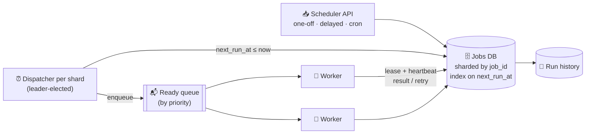

# 097 · Design a Distributed Job Scheduler

> ⏱ 12 min · 📈 97% · 🅱️ Part B (advanced) · Phase 11: Data Processing & Advanced Designs
>
> `███████████████████░` 97% of the whole guide
>
> 🧬 **Atoms used:** queues [057] · leader election & leases [086] · fencing [086] · idempotency [055] · retries/backoff [063] · sharding [049] · delivery semantics [060] · observability [067]

---

## 📖 Story

Pantry runs on **time**. There are **100 million scheduled jobs**: weekly payouts, "your cooking class starts in one hour" reminders, nightly reconciliations, and retries for everything that failed.

All of it lives on **one cron box** in a corner of the datacenter. At 08:59 on a Monday its disk fills up. The box reboots. When it wakes, **the 9 am payout batch is simply gone**: no error, no alert, just **40,000 cooks** who don't get paid that week.

Maya adds a second cron box for redundancy. The next morning **both boxes fire**, and **12,000 reminder emails go out twice**.

One box forgets. Two boxes double up. I told Maya the answer isn't more boxes. It's a **board, a lease, and a rule that every job must be safe to run twice**. Let me show you.

## 🎯 One-sentence idea

**A distributed job scheduler stores each job with its next run time, finds due jobs through an index, hands each one to exactly one worker under an expiring lease, retries failures with backoff, and assumes any job may run twice, so every job must be idempotent.**

## 🧸 Analogy

A **hospital medication board**:

- The **board** lists every patient's next dose time (the jobs table).
- Every minute, a **coordinator** asks "who's due now?" and hands each due dose to a **free nurse** (a worker).
- The nurse **signs the task out with a time limit** (a lease). A nurse who doesn't report back in time has fainted, so the task goes to **another nurse**.
- Every dose is **written in the chart**, so a task done twice never means a patient gets **double-dosed** (idempotency).

## 🖼️ Visual

*Diagram brief:* an API writes jobs into a sharded jobs DB indexed on `next_run_at`. One leader-elected dispatcher per shard pulls due rows into a priority queue, and workers claim jobs under leases, heartbeat while running, and write results and run history back.



## 🔬 How it works

- **Requirements and estimates:** one-off, delayed, and **cron** jobs, plus cancel, retries, history, and priorities. Jobs run **within seconds** of their time and **at least once** (never silently skipped). **100M jobs**, with **10k/s due at the top of the hour**. By Little's Law, 10k/s × 30 s average = **300k concurrent runs**, so smooth the peaks or pre-scale the workers.
- **Finding due jobs, the core deep dive:** **(A) DB polling** with an index on `next_run_at` and `FOR UPDATE SKIP LOCKED` (simple, durable, good to a large scale), **(B) time buckets** in a Redis sorted set (`ZRANGEBYSCORE due -inf now`), or **(C) hierarchical timing wheels** in memory, backed by durable storage. **One dispatcher per shard**, chosen by **leader election** (lesson 086).
- **Executing reliably:** a worker **claims** a job with a **lease** (`locked_by`, `lease_expires_at`) and **heartbeats** to extend it. Success → mark done and compute the next run. Failure → **exponential backoff + jitter** (lesson 063) → after max attempts, **dead-letter + alert**. Lease expiry → a **reaper** makes the job claimable again → **at-least-once**.
- **Duplicates, defused:** the **attempt number doubles as a fencing token**, so a zombie worker from attempt 3 can't overwrite attempt 4's results. Every job is **idempotent**, keyed by `(job_id, scheduled_time)`.
- **Cron specifics:** store the expression **with an IANA time zone**, compute the next fire time after each run, and pick a **misfire policy** (run once, run all missed, or skip). Add **jitter** to "top of the hour" herds where the product allows it.
- **Fairness:** per-tenant **quotas, concurrency limits, and priority queues**, so one noisy tenant can't starve the rest (bulkheads).

## 🧩 Worked example

**Claiming jobs safely with Postgres:**

```sql
WITH due AS (
  SELECT job_id FROM jobs
  WHERE status = 'scheduled' AND next_run_at <= now()
  ORDER BY priority DESC, next_run_at
  LIMIT 100
  FOR UPDATE SKIP LOCKED              -- other dispatchers skip these rows: no double-claim
)
UPDATE jobs j
SET status = 'running', locked_by = :worker,
    lease_expires_at = now() + interval '60 seconds',
    attempt = attempt + 1
FROM due WHERE j.job_id = due.job_id
RETURNING j.job_id, j.payload, j.attempt;     -- attempt = fencing token
```

**The reaper for dead workers:**

```sql
UPDATE jobs SET status = 'scheduled', locked_by = NULL
WHERE status = 'running' AND lease_expires_at < now();   -- claimable again
```

**Retry schedule (base 30 s, cap 1 h, full jitter):**

```
attempt 1 fails → retry in random(0, 30 s)
attempt 2 fails → random(0, 60 s)
attempt 3 fails → random(0, 120 s) … capped at 1 h → after 8 attempts → DLQ + alert
```

**Monday morning, replayed:** a worker dies at 08:59:30 holding the payout job. Its lease expires at 09:00:30, the reaper releases the row, and another worker claims it as **attempt 2**. The payout writes are keyed by `(cook_id, period)`, so the half-finished attempt 1 can't double-pay anyone. **40,000 cooks paid by 09:04**, and **zero duplicate reminders**, because two dispatchers can never claim the same row.

## ⚖️ Trade-offs

| Decision | Maya's choice | Trade-off |
|---|---|---|
| Due-job detection | DB polling with SKIP LOCKED | Simple and durable, with DB load at extreme scale |
| Alternative | Redis buckets / timing wheels | Faster, and durability needs extra care |
| Delivery | At-least-once + idempotent jobs | Never skipped, with rare harmless duplicates |
| Dispatcher HA | Leader election per shard | No double dispatch, with a failover gap of seconds |
| Long jobs | Leases + heartbeats | Survives crashes, and lease length needs tuning |

## 🌍 Real world

- **Airflow** schedules workflow DAGs. **Temporal/Cadence** provide durable timers and workflows.
- **Quartz** clusters through a shared DB. **Sidekiq, Celery beat, Kubernetes CronJobs, and AWS EventBridge Scheduler** cover the everyday cases.
- **Kafka** uses hierarchical timing wheels internally for delayed operations.

## 📌 Cheat card

> - **Store `next_run_at`. Find due jobs fast** (index + SKIP LOCKED, sorted set, or timing wheels).
> - **Lease + heartbeat** per run. Expired lease → reclaim → **at-least-once**.
> - **Jobs must be idempotent.** The attempt number is the **fencing token**.
> - **Exponential backoff + jitter → DLQ.**
> - Cron: **time zones, misfire policy, top-of-hour herds.**

## 🧪 Feynman check

Explain the hospital medication board, what happens when a nurse faints mid-task, and why every dose must be written in the chart.

⚠️ **Common confusion:** "Our scheduler guarantees exactly-once execution." A crash between "work done" and "marked done" always means a re-run. Promise **at-least-once**, and make the **job** idempotent.

## ⚡ Quick recall

1. What does `FOR UPDATE SKIP LOCKED` achieve?
<details><summary>Reveal Answer</summary>

Several dispatchers or workers can claim different due jobs concurrently, without blocking each other or double-claiming the same rows.
</details>

2. What happens when a worker crashes mid-job?
<details><summary>Reveal Answer</summary>

Its lease expires, the reaper makes the job claimable again, and another worker runs it (at-least-once execution).
</details>

3. What's a misfire policy?
<details><summary>Reveal Answer</summary>

The rule for runs missed while the scheduler was down: run once now, run every missed occurrence, or skip them.
</details>

## 🎤 Interview practice

**Q. "Send 50M reminder emails at each user's local 9 am, and make sure no recurring job ever runs twice at the same time."**
<details><summary>Model answer</summary>

- **50M local-9 am reminders:**
  - Store each schedule with its **IANA time zone**, and precompute `next_run_at` in UTC. Due times arrive in **waves**, one per time zone.
  - **Batch** users into jobs of ~1,000 and dispatch from **per-minute buckets**, so 50M emails become ~50k jobs.
  - Workers send through the notification service (lesson 078), **idempotent per `(user_id, date)`**.
  - **Smooth the spike:** spread sends across 09:00–09:15 with jitter if the product allows it, and pre-scale workers ahead of each wave.
  - **Daylight saving:** compute from time zone rules at scheduling time, and recompute the next run after every run.
- **No overlapping runs:**
  - The claim query only picks `status = 'scheduled'`, and the **next occurrence is scheduled only after the current run finishes**.
  - **Leader-elected dispatchers** avoid duplicate enqueues, and **fencing tokens** (attempt numbers) block zombie writes.
  - Job logic stays **idempotent**, keyed by `scheduled_time`.
- **Likely follow-up:** "A run takes longer than its interval?" → a per-job **concurrency policy**: skip, queue, or allow overlap (like Kubernetes' `concurrencyPolicy`).
</details>

## 📖 Teaser

> 📖 *Every job now fires exactly when it should, and then a celebrity chef's class goes on sale: fifty seats, and a million fans clicking "buy" in the same second.*

---

⬅️ [096 · Payment System](096-design-payment-system.md) · 🗺️ [Phase map](README.md) · ➡️ [098 · Design Ticket Booking](098-design-ticket-booking.md)

✅ **Safe stopping point.** Tick lesson 097 in [PROGRESS.md](../../PROGRESS.md).
