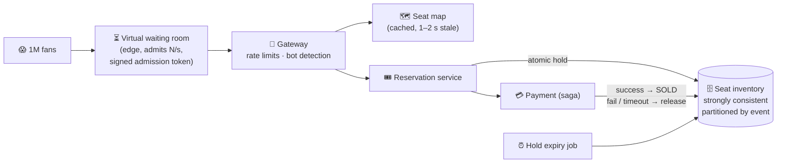

# 098 · Design Ticket Booking Under Contention (Ticketmaster)

> ⏱ 13 min · 📈 98% · 🅱️ Part B (advanced) · Phase 11: Data Processing & Advanced Designs
>
> `███████████████████░` 98% of the whole guide
>
> 🧬 **Atoms used:** transactions & isolation [035–036] · optimistic/pessimistic locking [036] · Redis atomics [033] · rate limiting & waiting rooms [024, 061] · caching & CDN [023, 027] · sagas/payment [088, 096] · idempotency [055]

---

## 📖 Story

A celebrity chef announces a live masterclass: **fifty seats**, on sale at **10:00:00**. At 09:59:58 there are **a million fans** with their thumbs over the "Buy" button.

Last time, it went badly. The checkout code read the seat, saw `available`, charged the card, then wrote `sold`. Between the read and the write, **dozens of other requests read the same `available`**. Pantry sold **73 tickets for 50 seats**. Then the seat-map endpoint took **500,000 reads per second**, the database connection pool emptied, and the whole site was down for an hour, including people just trying to order dinner.

The next sale is in three weeks. Maya gets **one chance** to rebuild it.

I told her the problem has two halves: a **stampede at the door** and a **fistfight over one chair**. Solve them separately. Let me show you how.

## 🎯 One-sentence idea

**When a million fans chase fifty thousand seats in the same minute, the design must never sell a seat twice (atomic holds on strongly consistent seat rows), hold seats briefly while people pay (holds with a TTL), and shield the core from the stampede (a virtual waiting room, cached seat maps, and rate limits).**

## 🧸 Analogy

A **concert box office** on release day:

- A **queue outside** lets people in a few at a time (the virtual waiting room), so the office isn't crushed.
- At the counter you pick a seat, and the clerk ties a **"reserved" tag on it for 10 minutes** while you pay (a hold with a TTL).
- Don't pay in time? The tag **expires** and the seat goes back on sale.
- The seat chart on the wall can be **a little out of date**. The clerk's final check at the counter is **always exact**.

## 🖼️ Visual

*Diagram brief:* a million fans hit an edge waiting room that admits a fixed rate with signed tokens. Admitted users browse a cached seat map, and the reservation service performs an atomic hold on the event-partitioned inventory, runs payment as a saga, and either confirms or releases. An expiry job sweeps abandoned holds.



## 🔬 How it works

- **Requirements and estimates:** browse, pick seats (or "best available"), hold, pay, get tickets. **Never double-sell.** Survive **100× spikes**, and stay fair against bots. **1M users in ~5 min ≈ 3k arrivals/s**, each refreshing the map every 2 s → **~500k reads/s**, but writes are **bounded by the seat count** (small). **It's a read storm plus contention on a few rows.**
- **Seat holds, the core deep dive:** states `AVAILABLE → HELD (holder, expires_at) → SOLD`, or back to `AVAILABLE`. Hold **atomically** with a DB conditional update (`... WHERE status = 'AVAILABLE'`, rows affected must equal seats requested) or a **Redis `SET NX EX 600`** gate (a Lua script for all-or-nothing multi-seat), with the DB as the source of truth. "Best available" = an atomic counter (`UPDATE ... SET remaining = remaining - n WHERE remaining >= n`).
- **Expiry and partitioning:** Redis TTLs + a **DB sweeper** (lesson 097) release abandoned holds, and confirmation **re-checks `hold_expires`**. **Partition by event**, and split one hot event **by section**, so no single lock queue grows long.
- **Checkout as a saga:** hold → order `PENDING` → **charge with an idempotency key** (lesson 096) → confirm `SOLD` **only if the hold is still yours and unexpired** → issue tickets. Payment fails or times out → **release the hold**. Paid but the hold expired (a rare race) → **refund** or re-hold.
- **Surviving the stampede:** an **edge waiting room** admits users at the rate the backend can absorb, and the booking APIs **require its signed token**. Seat maps come from a **CDN/cache with a 1–2 s TTL** (the hold is the real check). **CAPTCHA, device fingerprints, per-account limits, and per-user/IP rate limits** keep bots out, and non-critical endpoints are **shed** during the sale.

## 🧩 Worked example

**All-or-nothing multi-seat hold in Redis (Lua):**

```lua
-- KEYS = seat keys, ARGV[1] = user_id, ARGV[2] = ttl_seconds
for i, k in ipairs(KEYS) do
  if redis.call("EXISTS", k) == 1 then return 0 end     -- any seat taken → fail all
end
for i, k in ipairs(KEYS) do
  redis.call("SET", k, ARGV[1], "EX", ARGV[2])
end
return 1
```

**The confirmation guard (DB):**

```sql
UPDATE seats SET status = 'SOLD', order_id = :order
WHERE event_id = :e AND seat_id = ANY(:seats)
  AND status = 'HELD' AND holder = :user AND hold_expires > now();
-- rows updated must = seats requested, else the hold was lost → refund / compensate
```

**Why optimistic locking struggles here:** 10,000 users chasing **row A of the same section** means constant version conflicts and retry storms. **Atomic conditional updates fail fast**, and the **waiting room cuts concurrency** before it ever reaches the rows.

**The masterclass, replayed:** 1M fans → the waiting room admits **2,000/s** → the seat map serves **~98%** of reads from the CDN → fifty holds succeed in the first **400 ms**, and every other click gets "just taken" in **~5 ms**. **50 seats, 50 tickets, zero oversells**, and dinner orders never notice.

## ⚖️ Trade-offs

| Decision | Maya's choice | Trade-off |
|---|---|---|
| Seat state | Strongly consistent DB + Redis gate | Correctness over raw speed |
| Hold duration | ~10 min | Friendlier checkout, and inventory locked longer |
| Seat map | Cached, 1–2 s stale | Users sometimes pick a held seat → fast fail, retry |
| Admission | Virtual waiting room | Fairness and protection, and users wait |
| Locking | Atomic conditional updates | Fail fast, no retry storms like optimistic locking |

## 🌍 Real world

- **Ticketmaster's** biggest on-sales have repeatedly shown the danger of bots and stampedes. **Verified Fan** and its queue exist because of it.
- **Queue-it** and **Cloudflare Waiting Room** sell virtual waiting rooms as a service.
- The same pattern runs **flash sales, sneaker drops, airline seats, and hotel rooms**.

## 📌 Cheat card

> - **AVAILABLE → HELD (TTL) → SOLD.** Hold **atomically** (conditional update / Redis NX / Lua).
> - **Partition by event/section** to limit contention.
> - **Waiting room + rate limits + bot defense** protect the core.
> - **Seat map = cached, stale-OK. Hold/confirm = strongly consistent.**
> - Checkout is a **saga**: payment fails → **release**. Confirm re-checks the hold.

## 🧪 Feynman check

Explain the box office with the queue outside and the 10-minute reserved tags, and why the wall chart can be slightly wrong while the clerk's final check must be exact.

⚠️ **Common confusion:** "Wrap everything in a SERIALIZABLE transaction." It's correct, but thousands of transactions on the same hot rows produce **massive aborts and retries**. **Cut concurrency first** (the waiting room), then use **narrow atomic updates**.

## ⚡ Quick recall

1. What are the three seat states?
<details><summary>Reveal Answer</summary>

Available, held (with an owner and an expiry), and sold.
</details>

2. What does a virtual waiting room do?
<details><summary>Reveal Answer</summary>

It queues users at the edge and admits them at a controlled rate, protecting the backend and keeping the sale fair.
</details>

3. What happens if payment fails after a hold?
<details><summary>Reveal Answer</summary>

The saga compensates: it releases the held seats back to available and cancels the pending order.
</details>

## 🎤 Interview practice

**Q. "Two users click the same seat in the same millisecond. Walk through what happens, then explain how you stop bots from buying everything."**
<details><summary>Model answer</summary>

- **The same-seat race:**
  - Both saw the seat as available on a **cached** map, and both send hold requests.
  - The atomic operation (a DB conditional update or Redis `SET NX`) lets **exactly one** succeed.
  - The winner proceeds to checkout with a **10-minute hold**. The loser gets **"seat just taken"** in milliseconds, a refreshed map, and a suggested nearby seat.
  - **Redis succeeded but the DB write failed?** The DB is the source of truth: delete the Redis key (or let it expire), and confirmation always checks the DB.
- **Stopping bots:**
  - **Verified-fan pre-registration** with identity checks and lottery access codes.
  - **Edge defenses:** CAPTCHAs, behavioural and device fingerprinting, IP reputation, and rate limits.
  - **Per-account and per-payment-method purchase limits**, with abusive orders cancelled.
  - **Randomized waiting-room positions** at opening, so raw speed doesn't win.
- **Likely follow-up:** "Scalpers reselling?" → name-bound or rotating dynamic tickets, plus an official resale market with price caps.
</details>

## 📖 Teaser

> 📖 *Fifty seats sell to exactly fifty fans now, and the homepage wants something alive: a "Trending now" board, updated every few seconds, from millions of orders a minute.*

---

⬅️ [097 · Job Scheduler](097-design-job-scheduler.md) · 🗺️ [Phase map](README.md) · ➡️ [099 · Design Top-K / Trending](099-design-top-k-trending.md)

✅ **Safe stopping point.** Tick lesson 098 in [PROGRESS.md](../../PROGRESS.md).
