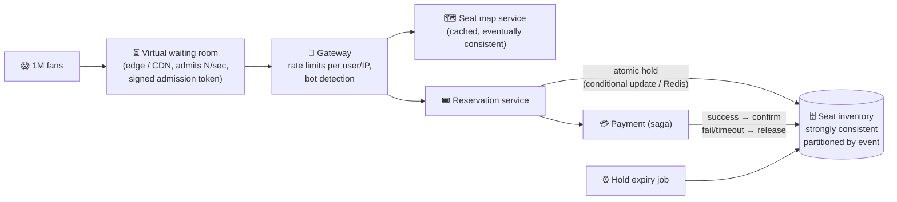

# 098 · Design Ticket Booking Under Contention (Ticketmaster)

> ⏱ 13 min · 📈 98% · 🅱️ Part B (advanced) · Phase 11: Data Processing & Advanced Designs
>
> `███████████████████░` 98% of the whole guide
>
> 🧬 **Atoms used:** transactions & isolation [035–036] · optimistic/pessimistic locking [036] · Redis atomics [033] · rate limiting & waiting rooms [024, 061] · caching & CDN [023, 027] · sagas/payment [088, 096] · idempotency [055]

---

## 📖 Story

A celebrity chef announced a live cooking class: fifty seats, and a million fans waiting at 10:00:00. Last time, Pantry sold 73 tickets for 50 seats and then crashed for an hour. I told Maya she'd get one chance to redesign it before the next sale. Let's make that chance count.

## 🎯 One-sentence idea

**When 1 million fans try to buy 50,000 seats in the same minute, the design must never sell a seat twice (strong consistency on seats), hold seats briefly while people pay (holds with a time limit), and protect the system from the stampede (a virtual waiting room, caching, and rate limiting).**

## 🧸 Analogy

A **concert box office** on release day:

- A **queue outside** lets people in a few at a time (the virtual waiting room), so the office isn't crushed.
- At the counter, you pick a seat, and the clerk puts a **"reserved" tag on it for 10 minutes** while you pay (a hold with a TTL).
- If you don't pay in time, the tag **expires** and the seat goes back on sale.
- The seat chart on the wall (browsing) can be **slightly out of date**, but the clerk's final check at the counter is **always exact**.

## 🖼️ Visual



## 🔬 How it works

### 1️⃣ Requirements
- **Functional:** browse events and seat maps, select specific seats (or "best available"), hold them during checkout, pay, and get tickets.
- **Non-functional:** **no double booking, ever**. Survive **extreme spikes** (100×+ normal load at on-sale time). Fairness (first come, first served, with bots blocked). Low latency for browsing, while checkout can be slightly slower.

### 2️⃣ Estimates
```
On-sale: 1M users arriving within ~5 min → ~3k new users/s, each refreshing the seat map ~every 2 s → 500k reads/s
Inventory: 50k seats · holds: at most ~50k concurrent · writes: bounded by the seat count (small!)
```
**So this means:** it's the **read storm plus contention on a small set of rows**. Protect the core with a waiting room, and serve the reads from caches.

### 3️⃣ Seat holds (the core deep dive)
- **Seat states:** `AVAILABLE → HELD (user, expires_at) → SOLD` (or back to `AVAILABLE` on expiry or cancel).
- **An atomic hold** (either one works):
  - **Database conditional update** (source of truth):
    `UPDATE seats SET status='HELD', holder=?, hold_expires=now()+10min WHERE event_id=? AND seat_id IN (...) AND status='AVAILABLE'` → the affected row count must equal the requested count, or roll back.
  - **Redis** as a fast gate: `SET seat:{event}:{seat} {user} NX EX 600` per seat (or a Lua script for multiple seats all-or-nothing), then persist to the DB.
- **Best available (general admission):** an atomic counter decrement (`DECRBY`, or `UPDATE ... SET remaining = remaining - n WHERE remaining >= n`).
- **Hold expiry:** a TTL in Redis + a DB sweeper job (lesson 097) releases expired holds. Check `hold_expires` at confirmation time too.
- **Partition by event** (and maybe by section), so one hot event doesn't lock the others. A single hot event → the rows are split by section, which reduces lock contention.

### 4️⃣ Checkout (saga)
1. Hold the seats (atomic) → 2. Create an order `PENDING` → 3. Charge the payment (with an idempotency key, lesson 096) → 4. Confirm the seats as `SOLD` (only if the hold is still owned by this user and not expired) → 5. Issue the tickets.
- Payment fails or times out → **release the hold** (compensation). Payment succeeds but the hold had expired (a rare race) → refund, or try to re-hold the same seats.

### 5️⃣ Surviving the stampede
- **Virtual waiting room** at the edge: users get a queue position and are admitted at a rate the backend can handle, with signed tokens required for the booking APIs.
- **Seat map reads** from a cache/CDN with a short TTL (1–2 s), or via pushed updates. It's eventually consistent, but the hold step is the real check.
- **Bot protection:** CAPTCHA, device fingerprinting, per-account purchase limits, and verified-fan presales.
- **Rate limits** per user and IP, and **load shedding** of non-critical endpoints during the on-sale.

## 🧩 Worked example

**Multi-seat all-or-nothing hold in Redis (Lua):**

```lua
-- KEYS = seat keys, ARGV[1] = user_id, ARGV[2] = ttl_seconds
for i, k in ipairs(KEYS) do
  if redis.call("EXISTS", k) == 1 then return 0 end     -- any seat already held/sold → fail
end
for i, k in ipairs(KEYS) do
  redis.call("SET", k, ARGV[1], "EX", ARGV[2])
end
return 1
```

**Confirmation guard (DB):**

```sql
UPDATE seats SET status = 'SOLD', order_id = :order
WHERE event_id = :e AND seat_id = ANY(:seats)
  AND status = 'HELD' AND holder = :user AND hold_expires > now();
-- rows updated must = number of seats, else the hold was lost → refund/compensate
```

**Why optimistic locking struggles here:** 10,000 users all trying to grab row 1 of the same section → constant version conflicts and retries. **Atomic conditional updates** (fail fast) + **the waiting room** (less concurrency) work better.

## ⚖️ Trade-offs

| Decision | Choice | Trade-off |
|---|---|---|
| Seat state | Strongly consistent (DB, with a Redis gate) | Correctness over raw speed |
| Hold duration | ~5–10 min | Longer = friendlier, but inventory is locked up |
| Seat map | Cached, eventually consistent | Users may pick an already-held seat → a fast failure and a retry |
| Admission | Virtual waiting room | Fairness and protection, but users wait |
| Locking style | Atomic conditional updates | Fast fail vs retries with optimistic locking |

## 🌍 Real world

- **Ticketmaster's** big on-sales (e.g., major stadium tours) have repeatedly shown the danger of bot traffic and stampedes. The **Verified Fan** and **queue** systems exist because of it.
- **Queue-it, Cloudflare Waiting Room** offer virtual waiting rooms as a service.
- The same pattern applies to **flash sales**, **limited sneaker drops**, **airline seats**, and **hotel rooms**.

## 📌 Cheat card

> - **AVAILABLE → HELD (TTL) → SOLD.** Hold **atomically** (conditional update / Redis NX / Lua).
> - **Partition by event/section** to limit contention.
> - **Virtual waiting room + rate limits + bot defense** protect the core.
> - **Seat map = cached (stale-OK). Hold/confirm = strongly consistent.**
> - Checkout is a **saga**: payment failure → **release the hold**. Confirmation checks that the hold is still valid.

## 🧪 Feynman check

Explain the box office with the queue outside and the 10-minute reserved tags, and why the wall chart can be slightly wrong but the clerk's final check must be exact.

⚠️ **Common confusion:** "Just use a transaction with SERIALIZABLE isolation for everything." It's correct, but thousands of concurrent transactions on the same hot rows cause massive aborts and retries. **Reduce concurrency first** (the waiting room), and use **narrow atomic updates**.

## ⚡ Quick recall

1. What are the three seat states?
<details><summary>Answer</summary>

Available, held (with an owner and an expiry), and sold.
</details>

2. What does a virtual waiting room do?
<details><summary>Answer</summary>

It queues users at the edge and admits them at a controlled rate, protecting the backend and ensuring fairness.
</details>

3. What happens if the payment fails after a hold?
<details><summary>Answer</summary>

The saga compensates by releasing the held seats back to available (and cancelling the pending order).
</details>

## 🎤 Interview practice

**Q1. "Two users click the same seat at the same millisecond. Walk through what happens."**
<details><summary>Model answer</summary>

- Both see the seat as available (a cached seat map).
- Both send hold requests. The atomic operation (DB conditional update, or Redis `SET NX`) lets **exactly one** succeed.
- The winner proceeds to checkout with a held seat (a 10-minute TTL). The loser gets "seat just taken" instantly and a refreshed map, and maybe an auto-suggested similar seat.
- **Likely follow-up:** "What if the Redis gate succeeds but the DB write fails?" → treat the DB as the source of truth: roll back the Redis key (or let it expire). Confirmation always checks the DB.
</details>

**Q2. "How do you stop bots from buying all the tickets?"**
<details><summary>Model answer</summary>

- **Pre-registration / verified fans** with identity checks, and lottery-based access codes.
- **Edge defenses:** CAPTCHAs, bot detection (behavioural and device fingerprints), IP reputation, and rate limits.
- **Per-account and per-payment-method purchase limits**, and cancelling orders flagged as abusive.
- A **waiting room with randomized positions** at the opening, so being faster doesn't win.
- **Likely follow-up:** "What about scalpers reselling?" → name-bound or dynamic (rotating) tickets, and official resale platforms with price caps.
</details>

> 📖 *Next, Leo wants a live "Trending now" board that updates every few seconds.*

---

⬅️ [097 · Job Scheduler](097-design-job-scheduler.md) · 🗺️ [Phase map](README.md) · ➡️ [099 · Design Top-K / Trending](099-design-top-k-trending.md)

✅ **Safe stopping point.** Tick lesson 098 in [PROGRESS.md](../../PROGRESS.md).
