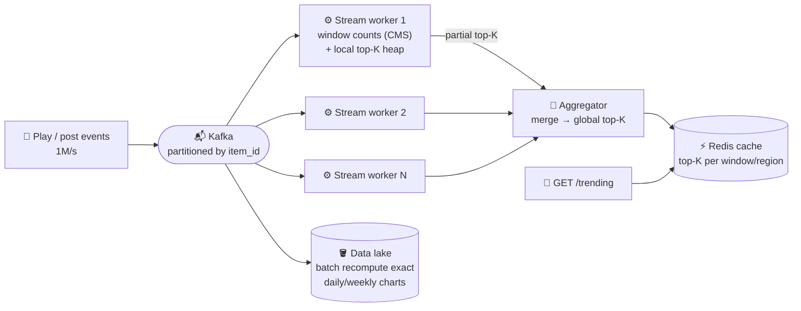

# 099 · Design Top-K / Trending (Heavy Hitters)

> ⏱ 12 min · 📈 99% · 🅱️ Part B (advanced) · Phase 11: Data Processing & Advanced Designs
>
> `███████████████████░` 99% of the whole guide
>
> 🧬 **Atoms used:** Kafka [059] · stream processing & windows [091] · count-min sketch & HLL [090] · sharding / partitioning [049] · caching [027] · batch reconciliation [091]

---

## 📖 Story

Leo wanted a live "Trending now" board on the home page: the top dishes of the last hour, for every city, updated every few seconds, from a million events per second. Counting everything exactly, everywhere, is impossible. I told Maya that, and she designed it anyway. Here's how.

## 🎯 One-sentence idea

**Finding the top K most frequent items (songs, hashtags, products) over a sliding time window at huge scale means you can't count everything exactly in one place. Partition the stream, keep approximate counts (a count-min sketch) plus a small heap of candidates per partition, merge the partial top-K lists, and serve the result from a cache.**

## 🧸 Analogy

Finding the **most popular songs in a country right now**:

- Each **city radio station** keeps a quick tally of the songs requested in the **last hour** (a partition-local count).
- Each station sends its **top 20** to the **national chart office** (the aggregator).
- The office **merges** the lists into the national **top 10**, updated every minute, and **publishes the chart** (a cache). Nobody reads every single request.
- Tallies are a bit approximate (some songs share a tally box), but the **hits clearly stand out**.

## 🖼️ Visual



## 🔬 How it works

### 1️⃣ Requirements
- Top K (e.g., 10–100) items by count over a **sliding window** (last 5 min / 1 h / 24 h), optionally per region or category. Results refresh every few seconds to a minute. **Approximate is OK** for real-time, and exact for official charts (batch).

### 2️⃣ Estimates
```
1M events/s · 100M distinct items · K = 100
Exact counts in one hashmap: 100M × ~50 B = 5 GB per window → too much churn, and a single-node bottleneck
```

### 3️⃣ Partition by item (the core deep dive)
- **Key the stream by item_id**, so **each item's counts live in exactly one partition**. The partition-local top-K lists are then **disjoint**, and merging them gives the **exact global top-K** of the counted values.
- (If the stream were partitioned randomly, each item would be split across partitions, and the local top-Ks would miss items that are moderately popular everywhere. You'd need a second aggregation stage keyed by item.)
- **Hot items** (one viral song) → pre-aggregate on the producers (local counts per second) before sending, to reduce the per-partition load.

### 4️⃣ Counting in a window
- **Exact** per-partition hashmap counts per window (fine if each partition's distinct items fit in memory).
- **Count-min sketch** (lesson 090) when the distinct items are too many: fixed memory with slight overcounting, plus a **min-heap of size K** of the current candidates (the heavy-hitters algorithm).
- **Sliding windows:** keep counts in **small buckets** (e.g., 1-minute buckets for a 1-hour window), add the new bucket and subtract the expired one, or use the stream engine's sliding windows (Flink).
- **Time decay** alternative for "trending": weight recent events more (an exponential decay score). Trending = high **velocity** vs the baseline, not just the raw count.

### 5️⃣ Merging and serving
- Each partition emits its top-K every few seconds → the aggregator merges them (a heap of N×K entries) → writes the global top-K to **Redis** (a sorted set or JSON) per window and region.
- The API reads from the cache. It's O(1), and CDN-cacheable for a few seconds.

### 6️⃣ Batch correction (Lambda-style)
- Nightly **batch jobs** over the data lake compute **exact** daily and weekly charts (the official ones), correcting the streaming approximations.

## 🧩 Worked example

**Heavy hitters with count-min + heap (per partition, per window):**

```python
cms = CountMinSketch(width=2**16, depth=5)
heap = MinHeap(capacity=K)           # (estimated_count, item)

def on_event(item):
    cms.add(item)
    est = cms.estimate(item)
    if item in heap:
        heap.update(item, est)
    elif len(heap) < K or est > heap.min():
        heap.push_or_replace_min(item, est)

def emit():                          # every 5 s
    return heap.sorted_desc()        # this partition's top-K → aggregator
```

**Sliding 1-hour window with 1-minute buckets:**

```
counts_by_minute[12:00] … counts_by_minute[12:59]
At 13:00: window_total += counts[13:00], window_total −= counts[12:00] (evict)
Memory: 60 buckets × distinct items per minute (or 60 small sketches)
```

**"Trending" vs "top":**

```
Top (1 h):      song A 2.0M plays (always popular), song B 900k
Trending score: plays_last_hour / avg_hourly_plays_last_week
                song A: 2.0M / 1.9M = 1.05   song B: 900k / 30k = 30 ← trending 🔥
```

## ⚖️ Trade-offs

| Decision | Choice | Trade-off |
|---|---|---|
| Partitioning | By item_id | Exact merge of local top-Ks, but hot items → hot partitions (pre-aggregate) |
| Counting | Hashmap vs count-min sketch | Exact but memory-heavy vs fixed memory but approximate |
| Windows | Buckets / sliding windows | Accuracy vs memory and CPU |
| Freshness | Emit every few seconds | Fresher costs more aggregator load |
| Accuracy | Streaming approximate + batch exact | Two pipelines (Lambda-style) |

## 🌍 Real world

- **Twitter/X trends**, **YouTube trending**, **Spotify charts**, and **Amazon best sellers** combine streaming counts with velocity-based scoring and batch-computed official rankings.
- **Redis Stack's TopK** (HeavyKeeper) and **count-min** modules, and **Apache DataSketches** (Yahoo) for production sketches.
- **Flink/Kafka Streams** windowed aggregations are the standard streaming building blocks.

## 📌 Cheat card

> - **Partition by item → local top-K are disjoint → merging = the global top-K.**
> - **Count-min sketch + min-heap of K** = heavy hitters in fixed memory.
> - **Sliding windows via time buckets.** **Trending = velocity vs baseline**, not the raw count.
> - **Serve from a cache** (Redis sorted set), refreshed every few seconds.
> - **Batch recompute** for exact official charts.

## 🧪 Feynman check

Explain the radio stations and the national chart office, and why it matters that each song is only counted at one station (partition by item).

⚠️ **Common confusion:** "Merge each server's top-K and you're done." If items are **spread across servers randomly**, an item that's #11 everywhere could be #1 overall, and you'd miss it. Partition by item first (or aggregate per item in a second stage).

## ⚡ Quick recall

1. Why partition the event stream by item ID?
<details><summary>Answer</summary>

So each item's full count lives in one partition, making partition-local top-K lists disjoint and their merge correct.
</details>

2. What does the min-heap of size K hold?
<details><summary>Answer</summary>

The current top-K candidates, with the smallest at the root, so a new item replaces the minimum if its count is higher.
</details>

3. How is "trending" different from "top"?
<details><summary>Answer</summary>

Trending measures the growth or velocity relative to a baseline, while top measures the absolute count.
</details>

## 🎤 Interview practice

**Q1. "Design 'top 10 most-viewed products in the last hour' for an e-commerce site with 500k views/s."**
<details><summary>Model answer</summary>

- View events → Kafka, keyed by product_id → Flink with **sliding windows** (1 h, sliding every 1 min) → per-partition counts + a local top-K heap → an aggregator merges them into the global top 10 per category and region → Redis sorted sets → the API/CDN.
- Pre-aggregate on the producers for viral products. Dedupe bot views upstream.
- The nightly batch computes exact figures for reporting.
- **Likely follow-up:** "Top 10 per each of 5,000 categories?" → the same pipeline, keyed by (category, product). Emit a top-K per category, and store each category's list separately.
</details>

**Q2. "Memory is limited: 10 billion distinct items per day. How do you count?"**
<details><summary>Model answer</summary>

- A **count-min sketch** per window (e.g., a few MB) for approximate frequencies + a **heavy-hitters heap** for the candidates, plus **HyperLogLog** if distinct counts are also needed.
- Accept a bounded overcount error (ε·N with probability 1−δ), tuned by the sketch width and depth.
- For exact results on only the top items, do a second pass: exact counting for the candidate set from the heap (a much smaller key set).
- **Likely follow-up:** "What's the error bound?" → estimate ≤ true + ε·N, with width = e/ε and depth = ln(1/δ).
</details>

> 📖 *Next is the final chapter of this story, and it belongs to you.*

---

⬅️ [098 · Ticket Booking](098-design-ticket-booking.md) · 🗺️ [Phase map](README.md) · ➡️ [100 · Capstone](100-capstone.md)

✅ **Safe stopping point.** Tick lesson 099 in [PROGRESS.md](../../PROGRESS.md).
