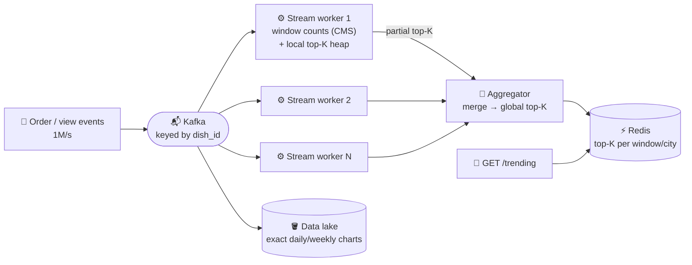

# 099 · Design Top-K / Trending (Heavy Hitters)

> ⏱ 12 min · 📈 99% · 🅱️ Part B (advanced) · Phase 11: Data Processing & Advanced Designs
>
> `███████████████████░` 99% of the whole guide
>
> 🧬 **Atoms used:** Kafka [059] · stream processing & windows [091] · count-min sketch & HLL [090] · sharding / partitioning [049] · caching [027] · batch reconciliation [091]

---

## 📖 Story

The homepage gets a new strip: **"🔥 Trending now in your city."** The top dishes of the last hour, for **4,000 cities**, refreshed every few seconds, from **one million order, view, and search events per second**.

Maya's first version is honest and doomed. Every event does `UPDATE dish_counts SET n = n + 1`, and every page load runs `ORDER BY n DESC LIMIT 10`. Within an hour, **the same twelve hot rows** absorb thousands of increments a second, lock waits climb past **2 seconds**, and the "live" board shows **yesterday's lunch** at dinnertime.

Her second version is worse in a quieter way. Each of twenty servers keeps its own top 10 and she merges them. A new **birria taco** is the **#11 dish on every server**, which makes it **#1 overall**, and it never appears on the board at all.

I told Maya that counting everything, exactly, in one place, is impossible at this scale. You don't need to. You need to **count in the right place, approximately, and merge correctly**. Let me show you.

## 🎯 One-sentence idea

**Finding the top K most frequent items over a sliding window at huge scale means partitioning the stream by item, keeping fixed-memory approximate counts (a count-min sketch) plus a small heap of candidates per partition, merging the disjoint partial top-K lists, and serving the result from a cache.**

## 🧸 Analogy

The **national music chart**:

- Each **city radio station** tallies the songs requested in the **last hour** (partition-local counts).
- Each station sends its **top 20** to the **national chart office** (the aggregator).
- The office **merges** them into the national **top 10** every minute and **pins it on the wall** (the cache). Nobody re-reads every request.
- The tallies are slightly approximate (some songs share a tally box), but **the hits stand out** anyway.

## 🖼️ Visual

*Diagram brief:* a firehose of events enters Kafka keyed by item, each stream worker keeps windowed sketch counts and a tiny heap, an aggregator merges the partial lists into a Redis sorted set per window and city, and the API reads only that cache. A side channel feeds the lake for exact nightly charts.



## 🔬 How it works

- **Requirements and estimates:** top K (10–100) over **sliding windows** (5 min / 1 h / 24 h), per city or category, refreshed every few seconds. **Approximate is fine live**, and official charts are exact (batch). **1M events/s, 100M distinct items**: one exact hashmap ≈ 100M × 50 B = **5 GB per window** on one node, a churning single bottleneck.
- **Partition by item, the core deep dive:** **key the stream by `dish_id`**, so each item's full count lives in **exactly one partition**. The local top-K lists are then **disjoint**, and merging them is **correct**. Random partitioning splits each item's count, and a dish at #11 everywhere vanishes (the birria taco). **Hot items** → **pre-aggregate on producers** (per-second local counts) before sending.
- **Counting in a window:** an exact per-partition hashmap if the distinct items fit, otherwise a **count-min sketch** (lesson 090: fixed memory, slight overcount) plus a **min-heap of size K** (the heavy-hitters pattern). Sliding windows = **small time buckets** (60 × 1-minute for 1 hour): add the newest, subtract the evicted, or let Flink's sliding windows do it.
- **Trending ≠ top:** trending is **velocity vs a baseline** (`last_hour / avg_hour_last_week`, or an exponential-decay score), so an always-popular pizza doesn't drown out a sudden surge.
- **Merge, serve, correct:** partitions emit their top-K every ~5 s → the aggregator merges N×K entries in a heap → writes a **Redis sorted set** per window/city. The API is an O(1) read, **CDN-cacheable for a few seconds**. Nightly **batch** over the lake computes **exact** official charts (Lambda-style).

## 🧩 Worked example

**Heavy hitters with count-min + heap (per partition, per window):**

```python
cms = CountMinSketch(width=2**16, depth=5)   # ~1.3 MB of counters, fixed
heap = MinHeap(capacity=K)                   # (estimated_count, item)

def on_event(item):
    cms.add(item)
    est = cms.estimate(item)
    if item in heap:
        heap.update(item, est)
    elif len(heap) < K or est > heap.min():
        heap.push_or_replace_min(item, est)

def emit():                                  # every 5 s
    return heap.sorted_desc()                # this partition's top-K → aggregator
```

**Sliding 1-hour window with 1-minute buckets:**

```
counts[12:00] … counts[12:59]
At 13:00: window += counts[13:00]; window −= counts[12:00]   (evict)
Memory: 60 small sketches per partition, not one giant map
```

**"Trending" vs "top":**

```
Top (1 h):  margherita pizza 2.0M orders, birria tacos 900k
Trending:   orders_last_hour / avg_hourly_last_week
            pizza: 2.0M / 1.9M = 1.05      birria: 900k / 30k = 30 ← trending 🔥
```

**The homepage, replayed:** zero database rows are touched per event. Twenty Flink workers hold **~30 MB of sketches each**, the board refreshes **every 5 s**, `GET /trending` answers in **~2 ms** from Redis, and the birria taco tops the board **four minutes** after the surge starts.

## ⚖️ Trade-offs

| Decision | Maya's choice | Trade-off |
|---|---|---|
| Partitioning | By `dish_id` | Correct merge, and hot items need producer pre-aggregation |
| Counting | Count-min sketch + heap | Fixed memory, slight overcount |
| Windows | 1-minute buckets | Accuracy vs memory and CPU |
| Freshness | Emit every 5 s | Fresher costs more aggregator load |
| Accuracy | Stream approximate + batch exact | Two pipelines to run (Lambda-style) |

## 🌍 Real world

- **X trends, YouTube trending, Spotify charts, and Amazon best sellers** blend streaming counts, velocity scoring, and batch-computed official rankings.
- **Redis Stack's TopK** (HeavyKeeper) and count-min modules, and **Apache DataSketches**, ship production-grade sketches.
- **Flink and Kafka Streams** windowed aggregations are the standard building blocks.

## 📌 Cheat card

> - **Partition by item → local top-Ks are disjoint → merge = global top-K.**
> - **Count-min sketch + min-heap of K** = heavy hitters in fixed memory.
> - **Sliding windows via time buckets.** **Trending = velocity vs baseline.**
> - **Serve from Redis**, refreshed every few seconds.
> - **Batch recompute** for exact official charts.

## 🧪 Feynman check

Explain the radio stations and the chart office, and why it matters that each song is counted at only one station.

⚠️ **Common confusion:** "Merge each server's top-K and you're done." If items are spread **randomly** across servers, a dish that's **#11 everywhere** can be **#1 overall**, and the merge misses it. Partition by item first, or add a second aggregation stage keyed by item.

## ⚡ Quick recall

1. Why partition the event stream by item ID?
<details><summary>Reveal Answer</summary>

So each item's full count lives in one partition, making the partition-local top-K lists disjoint and their merge correct.
</details>

2. What does the min-heap of size K hold?
<details><summary>Reveal Answer</summary>

The current top-K candidates, smallest at the root, so a new item replaces the minimum whenever its estimated count is higher.
</details>

3. How is "trending" different from "top"?
<details><summary>Reveal Answer</summary>

Trending measures growth or velocity relative to a baseline. Top measures the absolute count.
</details>

## 🎤 Interview practice

**Q. "Design 'top 10 most-viewed products in the last hour' at 500k views/s, then count 10 billion distinct items a day with limited memory."**
<details><summary>Model answer</summary>

- **Top 10 in the last hour:**
  - View events → **Kafka keyed by `product_id`** → Flink **sliding windows** (1 h, sliding every minute) → per-partition counts + a local top-K heap.
  - An **aggregator** merges them into the global top 10 per category and region → **Redis sorted sets** → API + a few seconds of CDN caching.
  - **Pre-aggregate on producers** for viral products, and **dedupe bot views** upstream.
  - **Nightly batch** produces exact figures for reporting.
  - **5,000 categories?** Key by `(category, product)` and keep one top-K list per category.
- **10B distinct items, little memory:**
  - A **count-min sketch per window** (a few MB) + a **heavy-hitters heap**, plus **HyperLogLog** if distinct counts are needed too.
  - Accept a bounded overcount: estimate ≤ true + **ε·N** with probability **1−δ**, where **width = e/ε** and **depth = ln(1/δ)**.
  - Need exact numbers for the winners? A **second pass** counts only the heap's candidate set exactly.
- **Likely follow-up:** "Why not a Redis sorted set with `ZINCRBY` per event?" → fine at thousands per second, but at 1M/s it's one hot key per city, and memory grows with every distinct item. Sketches stay fixed-size.
</details>

## 📖 Teaser

> 📖 *Every atom is in place now, and Maya faces the blank whiteboard one last time: design all of Pantry, end to end, from the first tap to the last delivery.*

---

⬅️ [098 · Ticket Booking](098-design-ticket-booking.md) · 🗺️ [Phase map](README.md) · ➡️ [100 · Capstone](100-capstone.md)

✅ **Safe stopping point.** Tick lesson 099 in [PROGRESS.md](../../PROGRESS.md).
