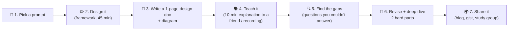

# 100 · Capstone: Design It & Teach It Back

> ⏱ 60–120 min (split it across sittings!) · 📈 100% · 🅱️ Part B (advanced) · Phase 11: Data Processing & Advanced Designs
>
> `████████████████████` 100% of the whole guide 🎓
>
> 🧬 **Atoms used:** all of them. This is where you prove it.

---

## 📖 Story

Years have passed. Pantry feeds millions of people, and Maya now leads the design reviews. Last month, I watched a nervous junior engineer sit across from her, just as Maya once sat across from me. She smiled and said, "Let me tell you a story." And now, dear reader, I'm handing the pen to *you*. It's time to write your own chapter.

## 🎯 One-sentence idea

**True mastery, the Feynman way, means you can design a system you've never seen, justify every choice with requirements and numbers, and teach it so clearly that a beginner understands. The capstone is doing exactly that, end to end, and publishing it.**

## 🧸 Analogy

A **cooking school's final exam**: you've learned knife skills, sauces, baking, and plating (the atoms). Now you're given a **mystery basket** of ingredients and must **create a full meal**, then **explain each dish to the judges**: why this technique, why this order, and what you'd do differently for 500 guests. Passing means you can **cook anything**, not just recite recipes.

## 🖼️ Visual



## 🔬 How it works

**Step 1: pick a prompt you haven't studied** (or roll a die 🎲):

| # | Prompt | Hard parts to deep-dive |
|---|---|---|
| 1 | **Google Docs** (real-time collaborative editing) | OT vs CRDTs, presence, offline, version history |
| 2 | **Stock exchange / order matching engine** | Single-threaded matching, sequencing, ultra-low latency, fairness, replay |
| 3 | **Distributed message queue (build your own Kafka)** | Partitioned log, replication (ISR), consumer groups, retention |
| 4 | **Metrics & alerting platform (build Datadog)** | High-cardinality ingestion, TSDB, downsampling, alert evaluation |
| 5 | **Online multiplayer game backend** | UDP state sync, authoritative servers, matchmaking, anti-cheat |
| 6 | **Hotel/Airbnb booking** | Availability search, double-booking prevention, pricing, reviews |
| 7 | **Distributed cache (build Redis Cluster)** | Sharding, replication, failover, eviction, hot keys |
| 8 | **Ad click aggregation & billing** | Exactly-once counting, fraud filtering, streaming + batch reconciliation |
| 9 | **Code deployment system (build a CI/CD platform)** | Artifact storage, rollout orchestration, canaries, rollbacks |
| 10 | **LLM chat product (ChatGPT-style)** | Token streaming (SSE), GPU scheduling, rate limits, conversation storage, safety |

**Step 2: design it with the framework** (lesson 073), in 45 minutes, on paper.

**Step 3: write a one-page design doc:**
```
Title · Context & goals · Non-goals
Requirements (functional + non-functional, with numbers)
Estimates (QPS, storage, bandwidth)
API + data model
High-level diagram + read/write paths
Deep dives (2–3) with the trade-offs considered
Failure modes & mitigations
Observability, security, cost
Open questions / future work
```

**Step 4: teach it (the Feynman core).** Explain it in 10 minutes to a friend, a study group, a rubber duck, or a voice recording. **Avoid jargon without explanation.**

**Step 5: find the gaps.** Every "um, I'm not sure why…" moment is a gap. List them.

**Step 6: revise.** Go back to the relevant atom lessons (use [COVERAGE.md](../../COVERAGE.md) to find them), fix the gaps, and deepen two hard parts.

**Step 7: share it.** Publishing forces clarity, and invites feedback.

## 🧩 Worked example

**A mini walkthrough of prompt #10, "LLM chat product" (to show the depth expected):**

- **Requirements:** chat with streaming responses. Conversation history. 10M DAU, ~20 messages each. First token < 1 s, and smooth streaming. Per-user rate limits. Safety filtering.
- **Estimates:** 200M messages/day → ~2.3k/s avg (peak ~7k/s). Each response ~500 tokens at ~50 tokens/s → ~10 s of streaming → **~70k concurrent streams at peak** (Little's Law!).
- **API:** `POST /conversations/{id}/messages` → an **SSE stream** of tokens (lesson 016). `GET /conversations/{id}`.
- **High-level:** client → gateway (auth, **token-based rate limits**, lesson 024) → chat service → **inference router** → GPU model servers (continuous batching) → stream back. Conversations stored in a wide-column/document DB, keyed by user.
- **Deep dives:**
  - **GPU capacity:** queue requests with priority tiers, continuous batching for throughput, autoscaling on queue depth (GPUs boot slowly, so keep warm pools), and load shedding with a clear "busy" message (lesson 061).
  - **Streaming reliability:** SSE with resume (the last event ID). If the client disconnects, finish generating and store it, so a reconnect shows the full answer.
  - **Safety & cost:** input/output moderation, prompt caching for repeated system prompts, and usage metering per user (a stream → a billing ledger, lesson 096).
- **Failure modes:** a GPU node dies mid-stream → retry on another node from the start (idempotent by message ID), or return a partial answer with a retry button. The moderation service is down → fail closed for safety.

## ⚖️ Trade-offs

Your capstone doc must contain **at least three explicit trade-off decisions**, in this format:

| Decision | Options considered | Chosen | Because (requirement + number) | Cost we accept |
|---|---|---|---|---|
| e.g., Response delivery | WebSocket vs SSE | SSE | One-way token stream, simpler infrastructure | No client→server messages on the same channel |
| … | … | … | … | … |

## 🌍 Real world

- Senior engineers at top companies write **design docs** exactly like this before building anything big, and review each other's.
- **Staff-level interviews** often include "tell me about a system you designed", so your capstone becomes that story.
- **Teaching** (blog posts, talks) is how many engineers cement expertise. Feynman taught to learn.

## 📌 Cheat card

> - **Pick → Design → Write → Teach → Find gaps → Revise → Share.**
> - Every choice = **requirement + number + trade-off**.
> - **Gaps are gifts.** Each one points to an atom lesson to revisit ([COVERAGE.md](../../COVERAGE.md)).
> - Aim for **one capstone per month** to stay sharp.

## 🧪 Feynman check

The whole capstone *is* the Feynman check. The final test: **could a smart 16-year-old follow your 10-minute explanation and draw your diagram from memory afterwards?** If yes, you've mastered it.

⚠️ **Common confusion:** "Mastery means knowing every technology." Mastery means **reasoning from first principles** (the atoms) to a sound design, **explaining it simply**, and **knowing what you'd look up**. Technologies change, and the atoms don't.

## ⚡ Quick recall

1. What are the 7 capstone steps?
<details><summary>Answer</summary>

Pick a prompt, design it (framework), write a one-page doc, teach it, find the gaps, revise and deep-dive, share it.
</details>

2. What must every design decision in your doc include?
<details><summary>Answer</summary>

The requirement it serves, supporting numbers, the options considered, and the trade-off/cost accepted.
</details>

3. How do you use your "gaps"?
<details><summary>Answer</summary>

Map each one to the relevant atom lesson (via COVERAGE.md), relearn it, and update the design.
</details>

## 🎤 Interview practice

**Q1. "Tell me about a complex system you designed." (Use your capstone!)**
<details><summary>What a strong answer covers</summary>

- **Context and goals** (1 min), then the **key requirements with numbers**.
- The **architecture** in one diagram, and the **two hardest problems** and how you solved them.
- **Trade-offs** you made, and what you'd change with hindsight or more scale.
- **Results/metrics** (for a real project), or a validation plan (for a capstone).
- Keep it to about 5 minutes, and invite deeper questions.
</details>

**Q2. "Pick any capstone prompt and do a 45-minute mock with a friend acting as interviewer."**
<details><summary>How to run it</summary>

- The interviewer reads the prompt and answers clarifying questions (making reasonable assumptions).
- At minute ~20, they inject a twist: "traffic is 100× more", "the region fails", or "now it must be strongly consistent."
- Afterwards, both score it with the [80% gate rubric](../09-core-case-studies/checkpoint-80.md). Swap roles next time. **Interviewing others teaches you a lot too.**
</details>

> 📖 *That's the end of Maya's story, and the beginning of yours.*

---

⬅️ [099 · Top-K / Trending](099-design-top-k-trending.md) · 🗺️ [Phase map](README.md) · ➡️ [🎓 Checkpoint 100%](checkpoint-100.md)

✅ **Safe stopping point.** Tick lesson 100 in [PROGRESS.md](../../PROGRESS.md), then take the final 🎓 checkpoint!
