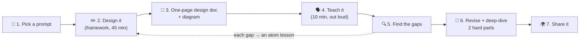

# 100 · Capstone: Design It & Teach It Back

> ⏱ 60–120 min (split it across sittings!) · 📈 100% · 🅱️ Part B (advanced) · Phase 11: Data Processing & Advanced Designs
>
> `████████████████████` 100% of the whole guide 🎓
>
> 🧬 **Atoms used:** all of them. This is where you prove it.

---

## 📖 Story

Pantry's leadership hands Maya a single sticky note: **"Ask the Chef."** An AI cooking assistant inside the app. **10 million people a day**, chatting while their onions burn, expecting the first word of an answer in **under one second**.

No ticket. No template. No architecture to copy. Just a **blank whiteboard**, a marker, and two weeks until the design review.

Two years ago, a blank whiteboard froze her. Today she uncaps the marker and writes **requirements** first. Then **numbers**. Then **one box per atom**: a gateway, a rate limiter, a queue, a cache, a stream, a ledger. When she reaches a box she can't explain simply, she circles it in red and **goes back to the lesson that built it**.

The review room goes quiet when she finishes. Not because the design is clever. Because **everyone understood it**.

I've walked beside Maya for ninety-nine lessons. This one, I'm handing the marker to *you*.

## 🎯 One-sentence idea

**Mastery, the Feynman way, means designing a system you've never seen, justifying every choice with a requirement and a number, and teaching it so clearly that a beginner can redraw it, so the capstone is exactly that: design, write, teach, find the gaps, revise, and publish.**

## 🧸 Analogy

A **cooking school's final exam**:

- You've drilled knife skills, sauces, baking, and plating (the atoms).
- Now you get a **mystery basket** and must **cook a full meal** from it.
- Then you **explain every dish to the judges**: why this technique, why this order, what changes for 500 guests.
- Passing means you can **cook anything**, not just recite recipes.

## 🖼️ Visual

*Diagram brief:* a seven-station loop, left to right. A die picks the prompt, a whiteboard becomes a one-page doc, a speech bubble marks the teaching step, a magnifying glass finds the gaps, a circular arrow sends you back to the atoms, and a globe publishes the result.

## 🔬 How it works

- **Pick a prompt you haven't studied** (or roll a die 🎲):

  | # | Prompt | Hard parts to deep-dive |
  |---|---|---|
  | 1 | **Google Docs** (real-time collaborative editing) | OT vs CRDTs, presence, offline, version history |
  | 2 | **Stock exchange matching engine** | Single-threaded matching, sequencing, ultra-low latency, replay |
  | 3 | **Build your own Kafka** | Partitioned log, ISR replication, consumer groups, retention |
  | 4 | **Metrics & alerting (build Datadog)** | High-cardinality ingest, TSDB, downsampling, alert evaluation |
  | 5 | **Multiplayer game backend** | UDP state sync, authoritative servers, matchmaking, anti-cheat |
  | 6 | **Hotel/Airbnb booking** | Availability search, no double-booking, pricing, reviews |
  | 7 | **Build Redis Cluster** | Sharding, replication, failover, eviction, hot keys |
  | 8 | **Ad click aggregation & billing** | Exactly-once counting, fraud filtering, stream + batch reconciliation |
  | 9 | **CI/CD platform** | Artifact storage, rollout orchestration, canaries, rollbacks |
  | 10 | **LLM chat product** ("Ask the Chef") | Token streaming, GPU scheduling, rate limits, storage, safety |

- **Design it** with the framework (lesson 073): 45 minutes, on paper, requirements → estimates → API → data model → high level → deep dives.
- **Write a one-page doc:** context and goals, non-goals, requirements **with numbers**, estimates, API + data model, diagram with read/write paths, **2–3 deep dives**, failure modes, observability, security, cost, and open questions.
- **Teach it (the Feynman core):** 10 minutes, out loud, to a friend, a study group, or a voice recording. **No jargon without an explanation.**
- **Find the gaps and revise:** every "um, I'm not sure why…" is a gap. Map each one to its atom lesson via [COVERAGE.md](../../COVERAGE.md), relearn it, fix the design, and deepen two hard parts.
- **Share it:** a blog post, a gist, a study group. Publishing forces clarity and invites feedback.

## 🧩 Worked example

**Maya's "Ask the Chef", the depth expected:**

- **Requirements:** streaming chat answers, conversation history, **10M DAU × ~20 messages**, **first token < 1 s**, per-user rate limits, safety filtering.
- **Estimates:** 200M messages/day → **~2.3k/s average, ~7k/s peak**. ~500 tokens per answer at ~50 tokens/s → **~10 s per stream** → Little's Law: 7k/s × 10 s = **~70k concurrent streams**.
- **API:** `POST /conversations/{id}/messages` → an **SSE token stream** (lesson 016), and `GET /conversations/{id}`.
- **High level:** client → gateway (auth, **token-based rate limits**, lesson 024) → chat service → **inference router** → GPU model servers with **continuous batching** → stream back. Conversations in a document/wide-column store keyed by `user_id`.
- **Deep dives:**
  - **GPU capacity:** priority queues, autoscaling on **queue depth**, **warm pools** (GPUs boot slowly), and load shedding with an honest "busy" message (lesson 061).
  - **Streaming reliability:** SSE resume via `Last-Event-ID`. A disconnected client's answer **finishes and is stored**, so a reconnect shows it whole.
  - **Safety and cost:** input/output moderation, **prompt caching** for repeated system prompts, and per-user usage metering into a **billing ledger** (lesson 096).
- **Failure modes:** a GPU node dies mid-stream → retry on another node, **idempotent by `message_id`**. The moderation service is down → **fail closed**.

## ⚖️ Trade-offs

Your capstone doc must contain **at least three explicit trade-off decisions** in this shape:

| Decision | Options considered | Chosen | Because (requirement + number) | Cost we accept |
|---|---|---|---|---|
| Response delivery | WebSocket vs SSE | SSE | One-way token stream, plain HTTP infrastructure | No client→server messages on the same channel |
| GPU scaling | Scale on CPU vs queue depth | Queue depth | 70k concurrent streams, GPUs boot in minutes | Idle warm-pool cost |
| Moderation outage | Fail open vs fail closed | Fail closed | Safety outranks availability for unsafe content | Users see "try again" during outages |

## 🌍 Real world

- Senior engineers at top companies write **design docs exactly like this** before building anything big, and review each other's.
- **Staff-level interviews** often open with "tell me about a system you designed." Your capstone becomes that story.
- **Teaching** (blog posts, talks) is how many engineers cement expertise. Feynman taught in order to learn.

## 📌 Cheat card

> - **Pick → Design → Write → Teach → Find gaps → Revise → Share.**
> - Every choice = **requirement + number + trade-off**.
> - **Gaps are gifts.** Each one points to an atom lesson ([COVERAGE.md](../../COVERAGE.md)).
> - **One capstone a month** keeps you sharp.

## 🧪 Feynman check

The whole capstone *is* the Feynman check. The final test: **could a smart 16-year-old follow your 10-minute explanation and redraw your diagram from memory?** If yes, you've mastered it.

⚠️ **Common confusion:** "Mastery means knowing every technology." Mastery means **reasoning from first principles** (the atoms) to a sound design, **explaining it simply**, and **knowing what you'd look up**. Technologies change. The atoms don't.

## ⚡ Quick recall

1. What are the seven capstone steps?

Reveal Answer

Pick a prompt, design it with the framework, write a one-page doc, teach it, find the gaps, revise and deep-dive, and share it.

2. What must every design decision in your doc include?

Reveal Answer

The requirement it serves, the supporting numbers, the options considered, and the cost accepted.

3. How do you use your gaps?

Reveal Answer

Map each one to its atom lesson (via COVERAGE.md), relearn it, and update the design.

## 🎤 Interview practice

**Q. "Tell me about a complex system you designed." (Use your capstone, then run it as a 45-minute mock.)**

Model answer

- **The 5-minute story:**
  1. **Context and goals** (1 min), then the **key requirements with numbers**.
  2. The **architecture in one diagram**, and the **two hardest problems** and how you solved them.
  3. The **trade-offs** you made, and what you'd change with hindsight or 100× scale.
  4. **Results** (a real project) or a **validation plan** (a capstone): load tests, SLOs, the metrics you'd watch.
  5. Stop and **invite deeper questions**.
- **The 45-minute mock:**
  - A friend reads a prompt aloud and answers clarifying questions with reasonable assumptions.
  - At minute ~20 they inject a twist: **"traffic is 100× higher"**, **"a region just failed"**, or **"now it must be strongly consistent."**
  - Afterwards, both of you score it with the [80% gate rubric](../09-core-case-studies/checkpoint-80.md), then swap roles. **Interviewing others teaches you as much as being interviewed.**
- **Likely follow-up:** "What would you do differently?" → name one real weakness (a hot partition, an unbounded queue, a single region), the signal that would reveal it, and the atom that fixes it.

## 📖 Teaser

> 📖 *Maya's whiteboard is full, and the marker is in your hand now: the next system, and the next story, are yours to design.*

---

⬅️ [099 · Top-K / Trending](099-design-top-k-trending.md) · 🗺️ [Phase map](README.md) · ➡️ [🎓 Checkpoint 100%](checkpoint-100.md)

✅ **Safe stopping point.** Tick lesson 100 in [PROGRESS.md](../../PROGRESS.md), then take the final 🎓 checkpoint!
