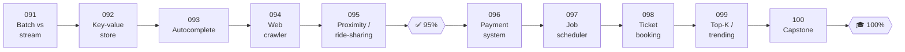

# 🚀 Phase 11: Data Processing & Advanced Designs

> **Lessons 091–100 · 91% → 100% · 🅱️ Part B (advanced)**
> The final stretch: large-scale data processing, then **specialist designs** that combine everything, including your own distributed KV store, search autocomplete, a web crawler, geo proximity, payments, a job scheduler, ticket booking under contention, and real-time top-K. It ends with a **capstone** where you design and teach a system of your choice.

| # | Lesson | ⏱ | Key atoms it exercises |
|---|---|---|---|
| 091 | [Batch vs stream processing](091-batch-vs-stream-processing.md) | 10 min | MapReduce, Spark, Flink, windows, watermarks |
| 092 | [Design a distributed key-value store](092-design-key-value-store.md) | 15 min | Consistent hashing, quorums, vector clocks, gossip, LSM, Merkle |
| 093 | [Design search autocomplete](093-design-autocomplete.md) | 12 min | Trie, top-K per prefix, caching, offline aggregation |
| 094 | [Design a web crawler](094-design-web-crawler.md) | 13 min | URL frontier, politeness, Bloom filters, dedup, distributed workers |
| 095 | [Design a proximity service / ride-sharing](095-design-proximity-service.md) | 14 min | Geohash, quadtree, location updates, matching |
| ✅ | [Checkpoint 95%](checkpoint-95.md) | 20 min | |
| 096 | [Design a payment system](096-design-payment-system.md) | 14 min | Idempotency, ledger, double-entry, reconciliation, sagas |
| 097 | [Design a distributed job scheduler](097-design-job-scheduler.md) | 12 min | Time-bucketed queues, leases, at-least-once, fencing |
| 098 | [Design ticket booking under contention](098-design-ticket-booking.md) | 13 min | Seat holds with TTL, strong consistency, virtual waiting room |
| 099 | [Design top-K / trending](099-design-top-k-trending.md) | 12 min | Count-min sketch, heaps, windows, stream aggregation |
| 100 | [Capstone: design it & teach it back](100-capstone.md) | 60+ min | Everything |
| 🎓 | [Checkpoint 100%: Mastery](checkpoint-100.md) | 45 min | Final exam + what's next |

📌 [Phase cheatsheet](CHEATSHEET.md) · 🎤 [Phase interview questions](INTERVIEW-QUESTIONS.md)

⬅️ Previous phase: [10 Deep internals](../10-deep-internals/README.md) · 🏠 [Home](../../README.md)
