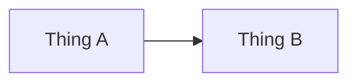

# NNN · Lesson Title

<!-- Copy this file into phases/NN-phase-name/ — the relative links below assume that location. -->

> ⏱ X min · 📈 NN% · 🅰️ Part A (core) · Phase NN — Phase Name
>
> `██████░░░░░░░░░░░░░░` NN% of the whole guide

---

## 📖 Story

A cinematic, first-person narration by the author. Maya (the only character) hits exactly the problem this lesson solves at Pantry, with a precise, painful metric (e.g., "p99 jumped from 80 ms to 4 s"). Short, active sentences and vivid physical metaphors. End with the author promising to show the infrastructure fix, never a vague "magic" one.

## 🎯 One-sentence idea

**The single idea of this lesson, in one plain sentence.**

## 🧸 Analogy

An everyday picture (a restaurant, a post office, a library…) that makes the idea feel obvious.

## 🖼️ Visual

*Diagram brief:* one or two sentences describing what the diagram shows.

## 🔬 How it works

3–6 dense bullets, no more.

- **Keyword:** short explanation.
- **Keyword:** short explanation.
- **Keyword:** short explanation.

## 🧩 Worked example

A concrete, small example with real numbers, a tiny code/SQL/curl snippet, or pseudo-code. Where it fits, replay the Story's incident with the fix in place, and give before/after metrics.

## ⚖️ Trade-offs

| You gain | You pay | Use it when |
|---|---|---|
| … | … | … |

## 🌍 Real world

- Where this shows up in real companies/products.

## 📌 Cheat card

> - Rule of thumb
> - Key number
> - Trick / mnemonic

## 🧪 Feynman check

Explain it to a friend in **3 sentences**, without jargon. If you get stuck, that's the gap — reread that part.

⚠️ **Common confusion:** …

## ⚡ Quick recall

Exactly three questions.

1. Question?

Reveal Answer

Answer.

2. Question?

Reveal Answer

Answer.

3. Question?

Reveal Answer

Answer.

## 🎤 Interview practice

Exactly one FAANG-style question.

**Q. Interview-style question?**

Model answer

- Key points a strong answer mentions
- Trade-offs
- **Likely follow-up:** …

## 📖 Teaser

> 📖 *A single-line cliffhanger in the author's voice, leading into the next lesson's problem.*

---

⬅️ [Prev](#) · 🗺️ [Phase map](README.md) · ➡️ [Next](#)

✅ **Safe stopping point.** Tick lesson NNN in [PROGRESS.md](../../PROGRESS.md).
