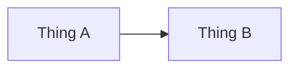

# NNN · Lesson Title

> ⏱ X min · 📈 NN% · 🅰️ Part A (core) · Phase NN — Phase Name
>
> `██████░░░░░░░░░░░░░░` NN% of the whole guide

---

## 🎯 One-sentence idea

**The single idea of this lesson, in one plain sentence.**

## 🧸 Analogy

An everyday picture (a restaurant, a post office, a library…) that makes the idea feel obvious.

## 🖼️ Visual

## 🔬 How it works

- **Keyword** — short explanation.
- **Keyword** — short explanation.
- **Keyword** — short explanation.

## 🧩 Worked example

A concrete, small example with real numbers, a tiny code/SQL/curl snippet, or pseudo-code.

## ⚖️ Trade-offs

| You gain | You pay | Use it when |
|---|---|---|
| … | … | … |

## 🌍 Real world

- Where this shows up in real companies/products.

## 📌 Cheat card

> - Rule of thumb
> - Key number
> - Trick / mnemonic

## 🧪 Feynman check

Explain it to a friend in **3 sentences**, without jargon. If you get stuck, that's the gap — reread that part.

⚠️ **Common confusion:** …

## ⚡ Quick recall

1. Question?

Answer

Answer.

## 🎤 Interview practice

**Q1. Interview-style question?**

Model answer

- Key points a strong answer mentions
- Trade-offs
- **Likely follow-up:** …

---

⬅️ [Prev](#) · 🗺️ [Phase map](README.md) · ➡️ [Next](#)

✅ **Safe stopping point.** Tick lesson NNN in [PROGRESS.md](../../PROGRESS.md).
